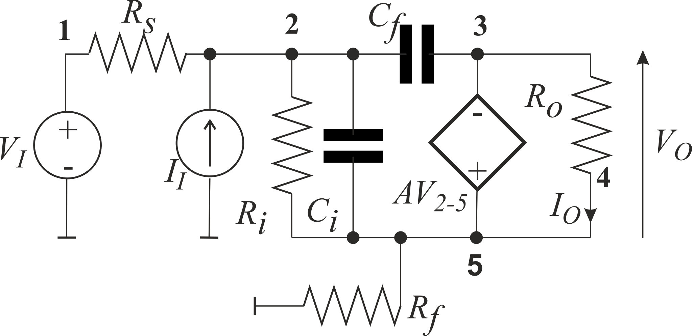

# Primitive MIMO example

The circuit have 2 inputs ( and ) and 2 outputs ( and ).

The common denominator is (voltage input, current output)

(1) 

The numerators: Copy denominator, remove pair of input gates and output gate (if they exist in copy). Finally add a pair in a form: %7D_%7B(a_O%2Bb_O)%7D).
<!-- $D=\varDelta^{(1+0)(4+5)}_{(1+0)(4+5)}$ -->

(2) 

<!-- $N_{vo\leftarrow vi}=\varDelta^{(1+0)(4+5)}_{(3+5)(4+5)}$ -->

(3) 

<!-- $N_{vo\leftarrow ii}=\varDelta^{(1+0)(4+5)(2+0)}_{(1+0)(4+5)(3+5)}$ -->

(4) 

<!-- $N_{io\leftarrow vi}=\varDelta^{(1+0)}_{(4+5)}$ -->

(5) 

<!-- $N_{io\leftarrow ii}=\varDelta^{(1+0)(2+0)}_{(1+0)(4+5)}$ -->

(6) 

<!-- $K_{vo\leftarrow vi}={{\varDelta^{(1+0)(4+5)}_{(3+5)(4+5)}}\over{\varDelta^{(1+0)(4+5)}_{(1+0)(4+5)}}}=\left(A\cdot R_i\right){{-1}\over{s\cdot\left(R_f+R_s \right)\cdot\left(\left(A+1\right)\cdot C_f+C_i \right)\cdot R_i+\left(R_f+R_s+R_i \right)}}$ -->

(7) 

<!-- $M_{vo\leftarrow ii}={{\varDelta^{(1+0)(4+5)(2+0)}_{(1+0)(4+5)(3+5)}}\over{\varDelta^{(1+0)(4+5)}_{(1+0)(4+5)}}}=\left(A\cdot R_s\cdot R_i \right){{-1}\over{s\cdot\left(R_f+R_s \right)\cdot\left(\left(A+1\right)\cdot C_f+C_i \right)\cdot R_i+\left(R_f+R_s+R_i \right)}}$ -->

(8) 

<!-- $N_{io\leftarrow vi}={{\varDelta^{(1+0)}_{(4+5)}}\over{\varDelta^{(1+0)(4+5)}_{(1+0)(4+5)}}}={{A\cdot R_i}\over{R_o}}{{-1}\over{s\cdot\left(R_f+R_s \right)\cdot\left(\left(A+1\right)\cdot C_f+C_i \right)\cdot R_i+\left(R_f+R_s+R_i \right)}}$ -->

(9) 

<!-- $K_{io\leftarrow ii}={{\varDelta^{(1+0)(2+0)}_{(1+0)(4+5)}}\over{\varDelta^{(1+0)(4+5)}_{(1+0)(4+5)}}}={{A\cdot R_s\cdot R_i}\over{R_o}}{{-1}\over{s\cdot\left(R_f+R_s \right)\cdot\left(\left(A+1\right)\cdot C_f+C_i \right)\cdot R_i+\left(R_f+R_s+R_i \right)}}$ -->
However, the calculation can be more effective if we represent the above formula as SoE:\
<!-- $X10=R_f+R_s+R_i$\ -->\
<!-- $X11=X10\cdot R_o$\ -->\
<!-- $X12=A+1$\ -->\
<!-- $X13=X12\cdot C_f$\ -->\
<!-- $X14=X13+C_i$\ -->\
<!-- $X15=R_f+R_s$\ -->\
<!-- $X16=X15\cdot X14\cdot R_i\cdot R_o$\ -->\
<!-- $X17=A\cdot R_i\cdot R_o$\ -->\
<!-- $X18=A\cdot R_s\cdot R_i\cdot R_o$\ -->\
<!-- $X19=A\cdot R_i$\ -->\
<!-- $X20=A\cdot R_s\cdot R_i$\ -->\
<!-- $\varDelta_{(1+0)(4+5)}^{(1+0)(4+5)}=s\cdot X16+X11$\ -->\
<!-- $\varDelta_{(3+5)(4+5)}^{(1+0)(4+5)} =- X17$\ -->\
<!-- $\varDelta_{(3+5)(1+0)(4+5)}^{(2+0)(1+0)(4+5)} =- X18$\ -->\
<!-- $\varDelta_{(4+5)}^{(1+0)}=- X19$\ -->\
<!-- $\varDelta_{(4+5)(1+0)}^{(2+0)(1+0)} =- X20$\ -->

The original results can be seen in [output file](./Models.txt)