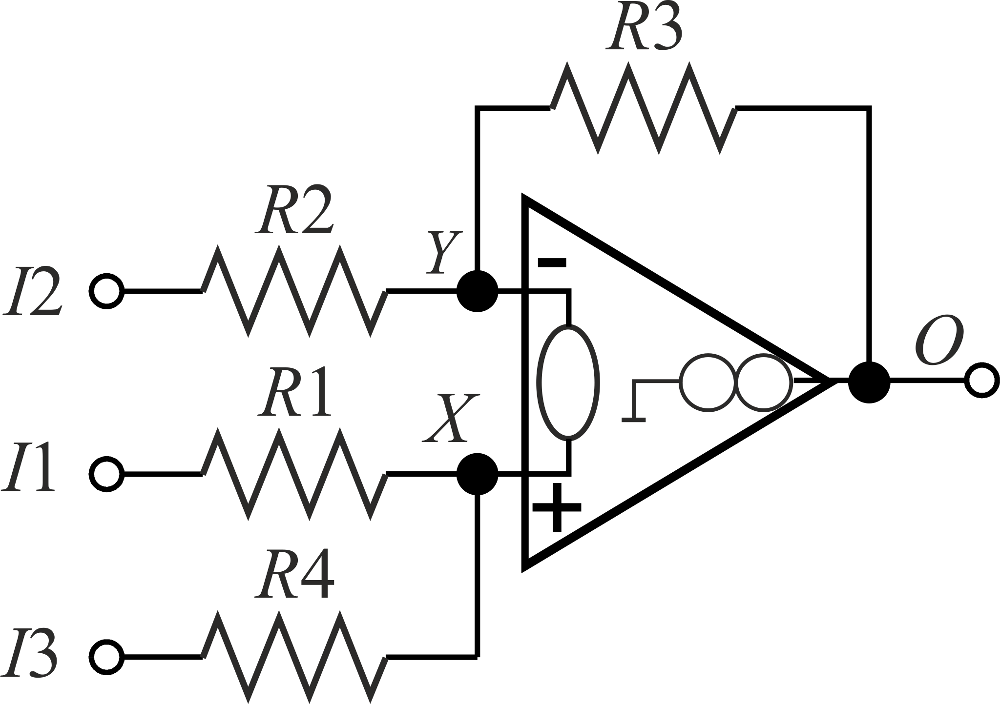

Basic cell made from resistors and the op-amp modelled as nullor. Its HPDD More detailes in [pdf form](./Model.pdf). The original meta-vertex can be found in [file](Models%201%20stage.txt) and [file](Models_MULTI_STAGE_EXAMPLE.txt), as well.

Differntial gain determination available in *HPDD with HOSC*.

Indirect differentail gain determination available in any method

Common gain determination

The result are presented in [pdf form](./Models%201%20stage.pdf). The complete and original results are in the [output file](./Models%201%20stage.txt).

A new circuit made od 2 basic cells.

Can be treated as a new cell, or as a target amplified. The result of analysis presented in [pdf form](./Models_MULTI_STAGE_EXAMPLE.pdf).

The complete and original result can be seen in [output file](./Models_MULTI_STAGE_EXAMPLE.txt)