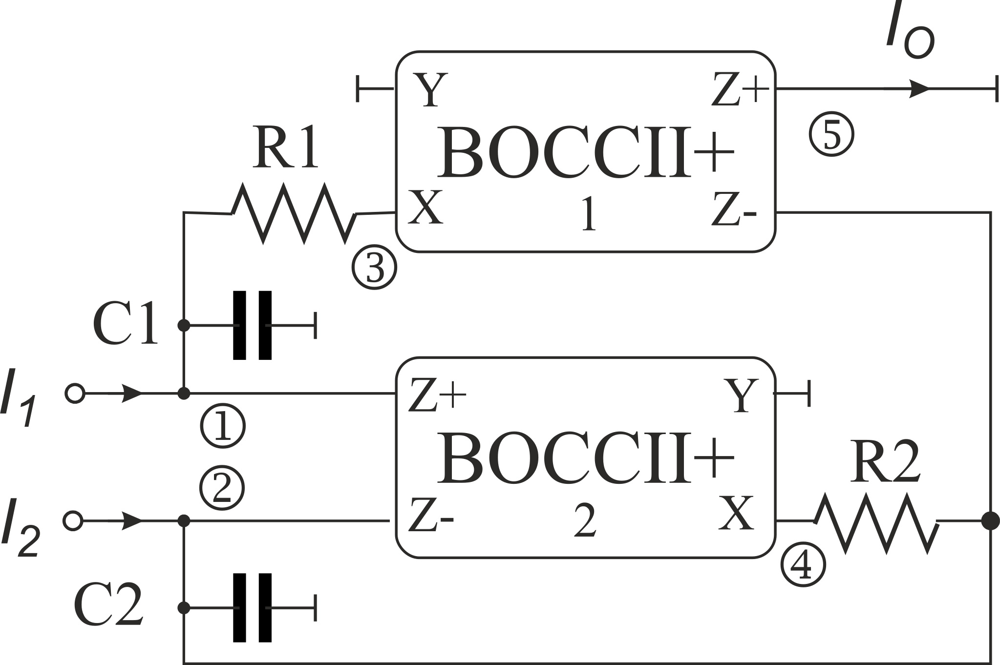
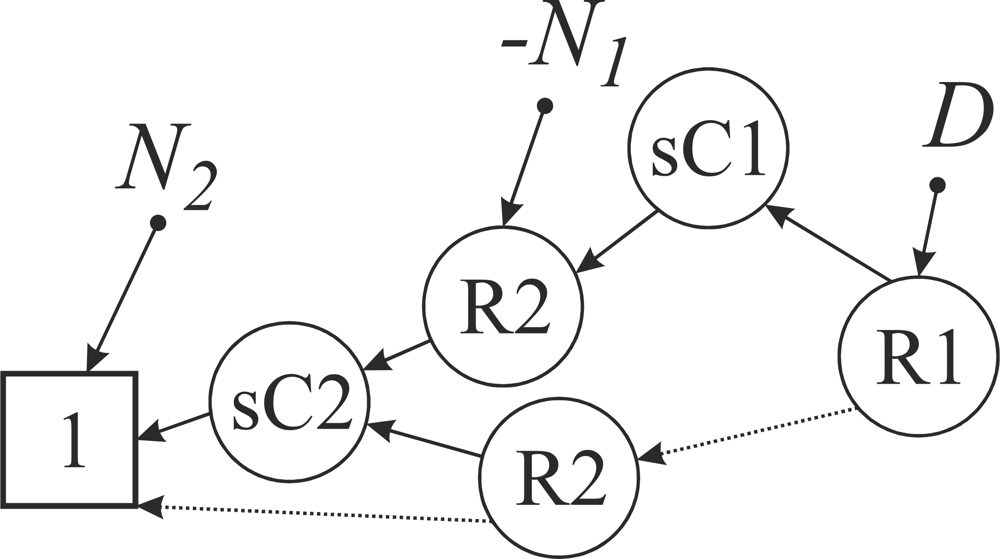
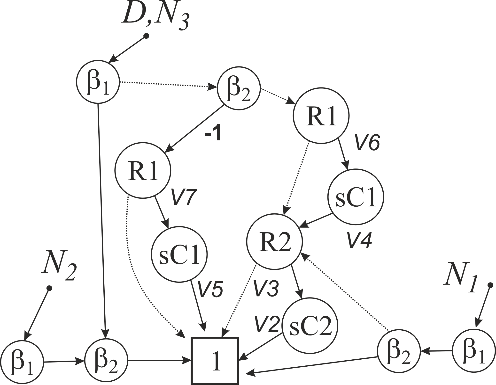

# Simply example of active device that can be modelled with only pathological components.

Model of BOCII cannot be modeled as set of the pathological components. That is why some researches try to find more or less complicated equivalents. However, in *HPDD with HOSC* approach it can be represented as a single *null-descendant meta-vertex* %7D%5E%7B(z_p-x)%7D%2B%5Cphantom%7Ba%7D_%7B(y%2Bx)%7D%5E%7B(z_n%2B0)%7D%20%5Cright)%3DM%5Cleft(%5Cphantom%7Ba%7D_%7B(y%2Bx)%7D%5E%7B(z_n%2Bz_p)%7D%2B%5Cphantom%7Ba%7D_%7B(y%2Bx)%7D%5E%7B(x%2B0)%7D%20%5Cright)).

The universal filter from **C. Sanchez-Lopez, F. V. Fernandez, E. Tlelo-Cuautle, and S. X. D. Tan, “Pathological Element-Based Active Device Models and Their Application to Symbolic Analysis,”** *IEEE Trans. Circuits Syst. I Regul. Pap.* **, vol. 58, no. 6, pp. 1382–1395, Jun. 2011.**

The trivial analysis with the idealized model presented above is available in [txt](./Models%20Ideal.txt), or post-processed in [pdf](Models%20Ideal.pdf) form. It yields result in PDD form:

Assuming tracking errors for the voltage follower (α) and the current followers (β, or even better βp and βn) we obtain results resp. [txt](Models%20Trucking%20Sym.txt) or [pdf](Models%20Trucking%20Sym.pdf) and [txt](Models%20Trucking%20Asym.txt) or [pdf](Models%20Trucking%20Asym.pdf). The PDD diagram looks as follow:

