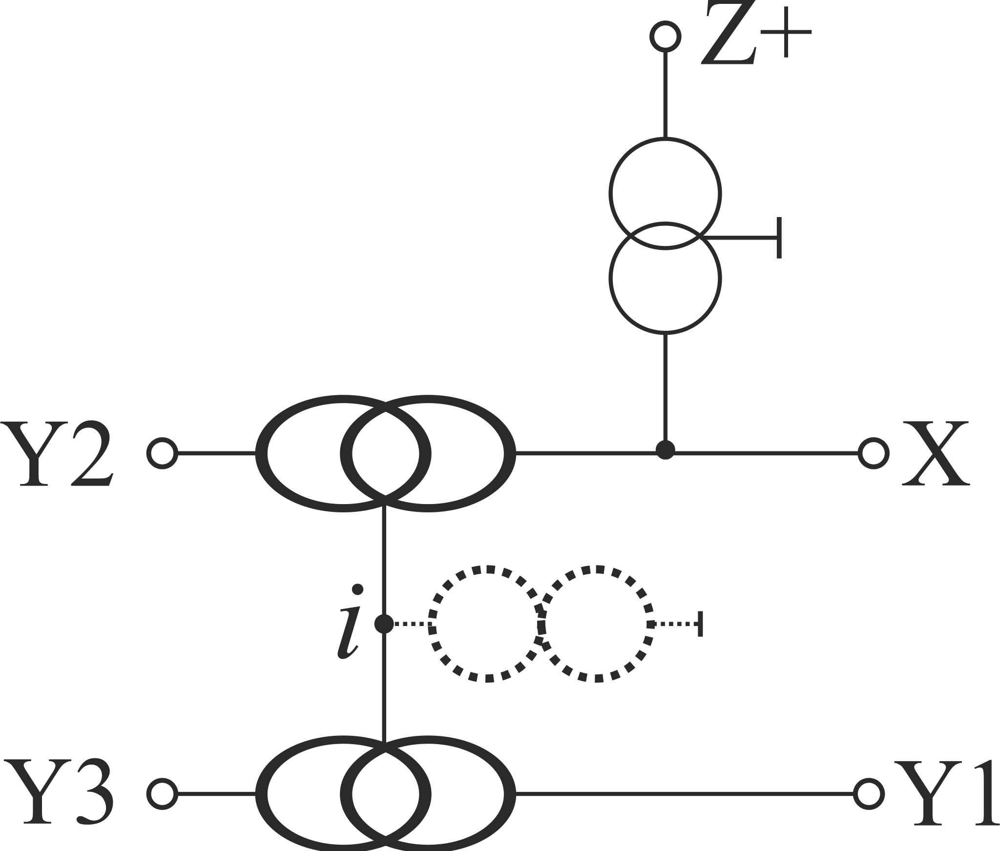
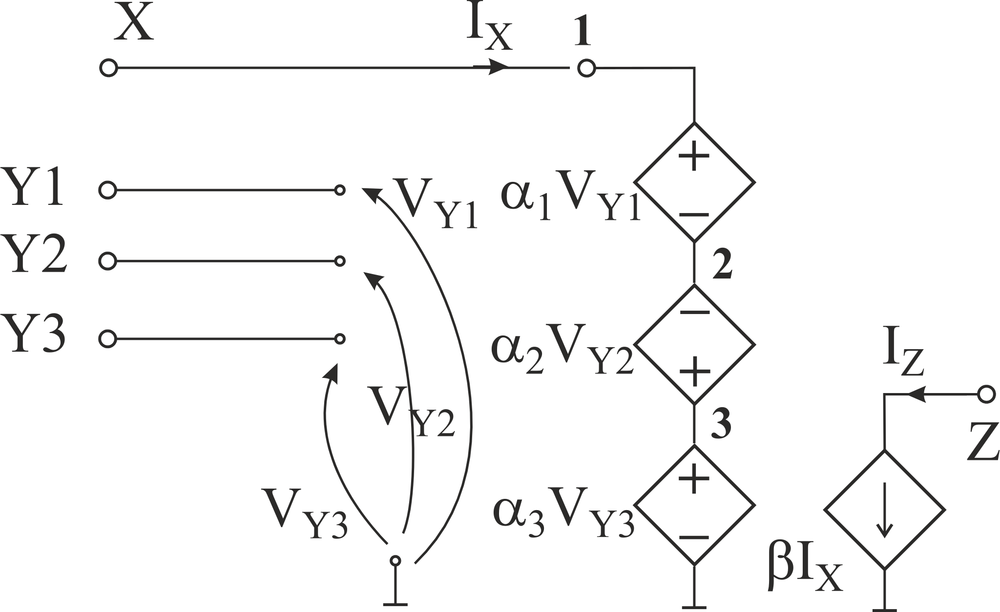

# Natural controlled sources DDCC model vs. floating pathological components model

In **H.-Y. Wang, N.-H. Chiang, Q.-M. Nguyen, and S.-H. Chang, “Circuit Synthesis Using Pathological Elements,” in** *Advanced Materials: Physics, Mechanics and Applications* **, Cham: Springer International Publishing, 2014, pp. 317–328** and in **H.-Y. Wang, S.-H. Chang, N.-H. Chiang, and Q.-M. Nguyen, “Symbolic Analysis Using Floating Pathological Elements,” in** *Genetic and Evolutionary Computing: Proceedings of the Seventh International Conference on Genetic and Evolutionary Computing* **, ICGEC 2013, August 25 - 27, 2013 - Prague, Czech Republic, Cham: Springer International Publishing, 2014, pp. 379–387** the floating pathological components are presented for DDCC modeling. 

In practice they are superflous. They can be replaced by natural controlled sources model that reduces to the same *null-descendant meta-vertex*, whose application to the *HPDD with HOSC* analysis is simply. Additionally models with tracking errors are more natural.

Results can be seen in [row txt](Models.txt) and postprocessed [pdf form](DDCCModel.pdf).