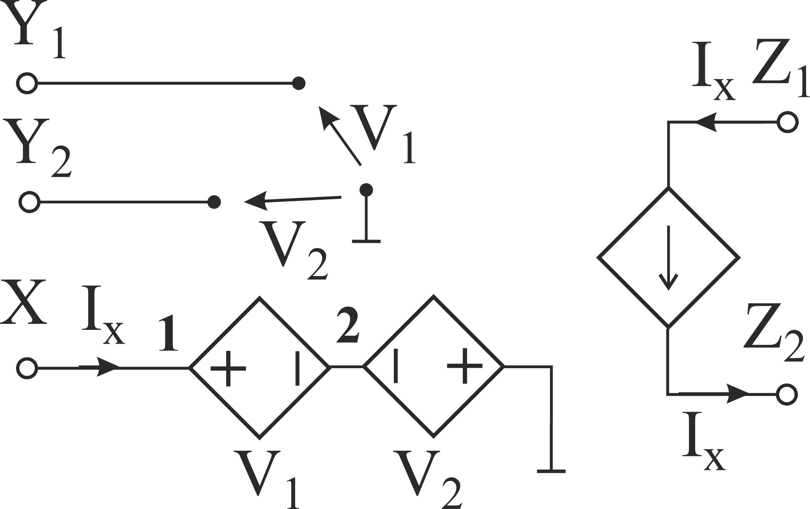
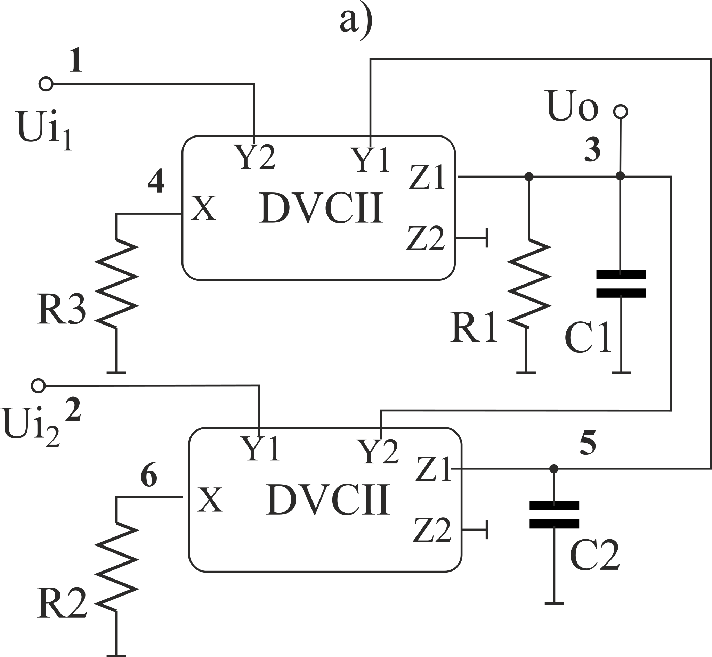
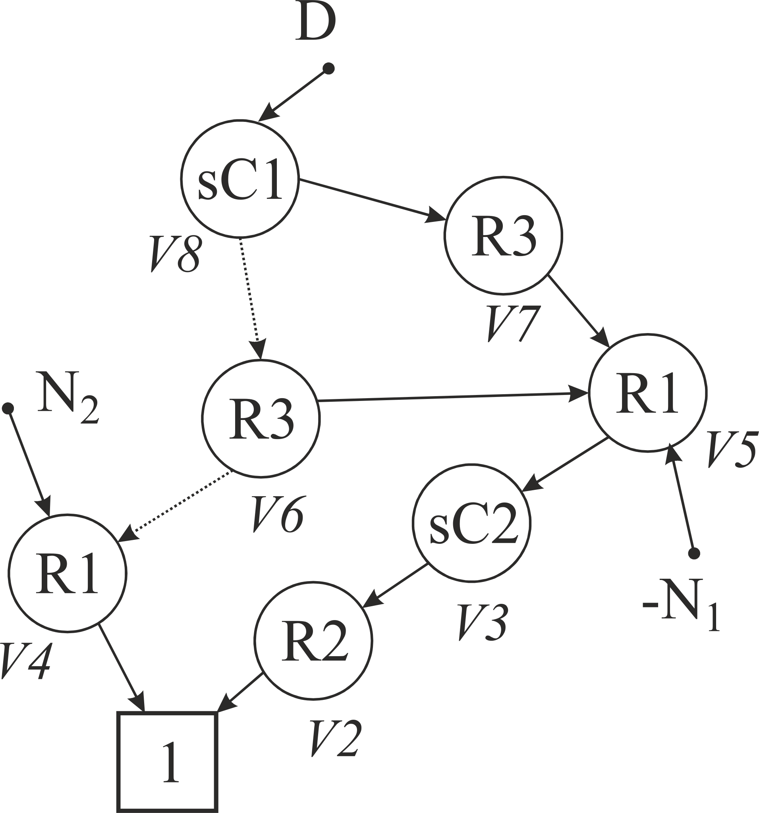

# DVCII based voltage filter

Differential voltage second generation current conveyors can be modeled as 

in the natural way from its behavioral description. To consider tracking errors we should introduce voltage gains (α1 and α2) and current gain (β) instead of followers. In case of the idealized model we have *null-descendant meta-vertex* %7D%5E%7B(z_n%2Bz_p)%7D-%5Cphantom%7B%20%7D_%7B(x%2B0)%7D%5E%7B(z_n%2Bz_p)%7D%2B%5Cphantom%7B%20%7D_%7B(x%2B0)%7D%5E%7B(x%2B0)%7D-%5Cphantom%7B%20%7D_%7B(y_p%2By_n)%7D%5E%7B(x%2B0)%7D%5Cright))

For filter

we obtain the fallowing simply PDD

The detailed result can be seen in [raw text](Models%20Ideal.txt) or [post-processed pdf](Models%20Ideal.pdf). 

For models with tracking errors we can the result in [raw text](Models%20TE.txt) or or [post-processed pdf](Models%20TE.pdf) in case α1=α2, and in [raw text](Models%20TEA.txt) or or [post-processed pdf](Models%20TEA.pdf), otherwise.