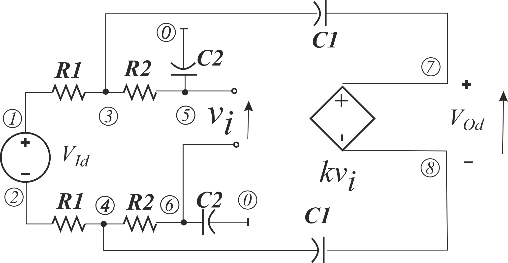
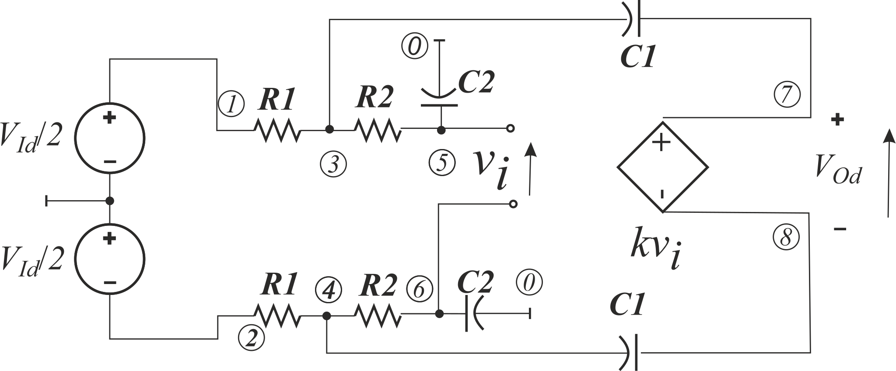
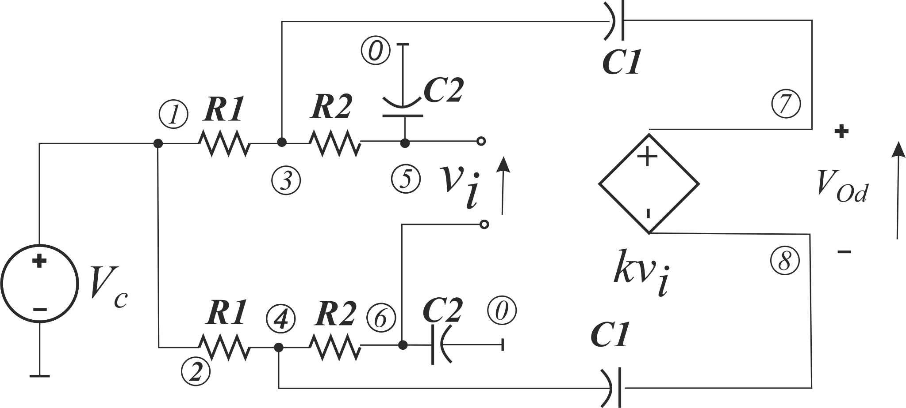

# Fully Differential Current Feedback Amplifier – Ideal but Unrealistic 

In **S. A. Mahmoud and I. A. Awad, “Fully Differential CMOS Current Feedback Operational Amplifier,”** *Analog Integr. Circuits Signal Process.* **, vol. 43, no. 1, pp. 61–69, Apr. 2005** there is FDCFOA based low-pass Sallen-Key bi-quad section presented. FDCFOA with 2 resistor (*R*, *kR*) stands for floating Voltage Controlled Voltage Source. It can be modeled as:

The above presented direct way for differential gain determination is available for *PDD with HOSC*, but it is not in the most of classical methods. In the last case, we are condemned for approach bellow:

The result is more complicated, however the same as above. The numerator and denominator are multiplied by the same binomial of *s*, which is not easy to notice and to reduce it.

The common gain is 0. 

Results can be seen in [raw text](Models.txt) and [post-processed pdf](Models.pdf).

However the model is wrong. Each active component is connected the power supplier and has reference node in the midpoint of the power supply voltage. It follows to another [example](../07.%20SimplySKFloatingFilterUnPropGnd/).