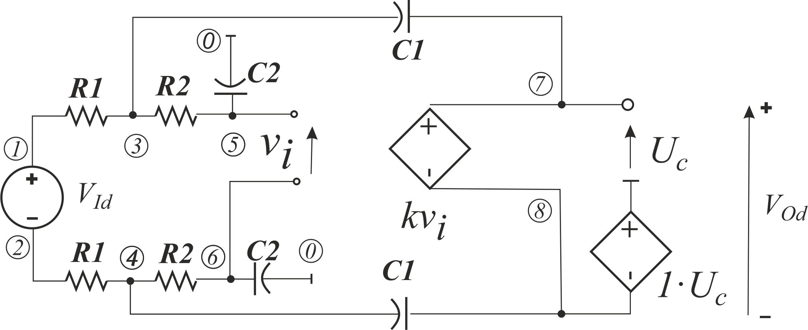
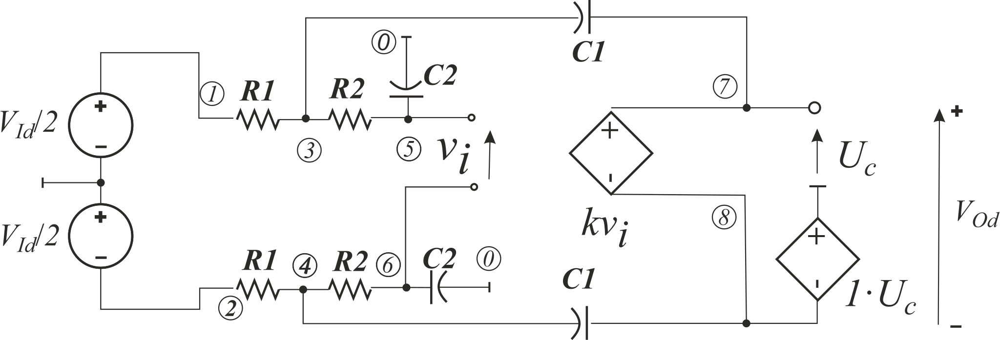
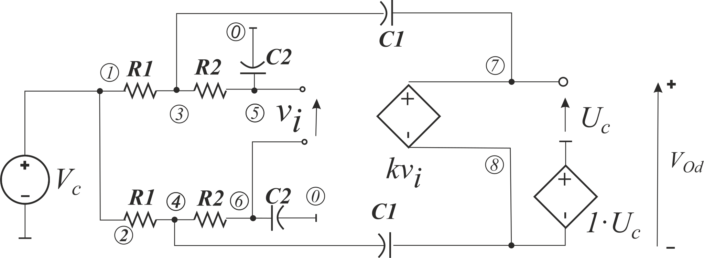

# FDCFOA as a floating VCVS with a common mode feedback (CFMB)

Realistic FDCFO (in **In S. A. Mahmoud and I. A. Awad, “Fully Differential CMOS Current Feedback Operational Amplifier,”** *Analog Integr. Circuits Signal Process.* **, vol. 43, no. 1, pp. 61–69, Apr. 2005**, as well) includes CFMB circuit, which set the output voltage symmetrically around the FDCFO reference node. It yields the set of circuits:

However, resulting transfer functions are wired. *Ku1* is not low-pass filter, Ku2 is even unstable, because the characteristic polynomial is not a Hurwitz polynomial. It has factors with different sign. It can be seen in [text form](Models.txt) or [post-processed pdf](Models.pdf). The problem is that VCVS with CFMB cannot model floating VCVS. However, if we assume that the reference node belongs only to the active FDCFO, we can remove this node in the analysis after considering FDCFO, according to HOSC arithmetic. It yields floating VCVS. Though, capacitors C2 should not be connected to this reference node. It fallows to the [next example](../08.%20SimplySKFloatingFilterPropGnd/). 
