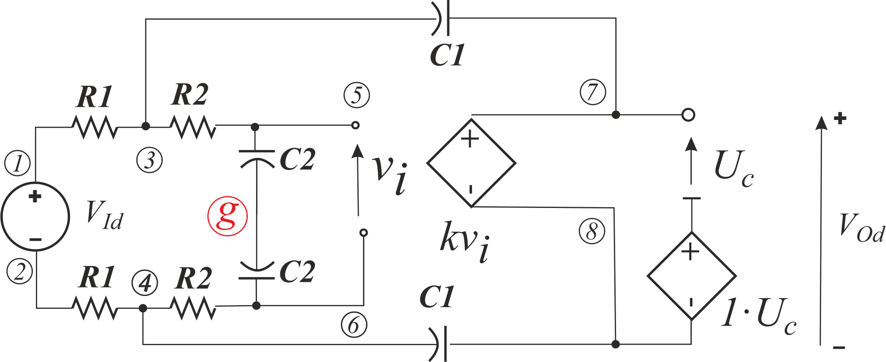
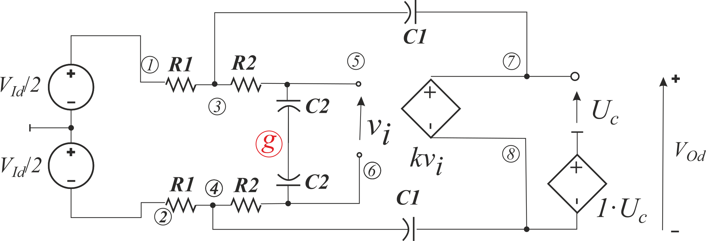
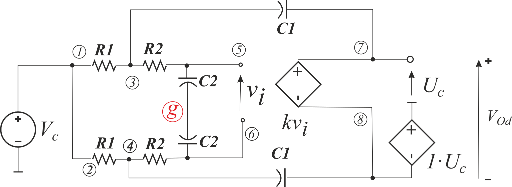

# VCVS with CFMB, but with private CFMB reference node

Replacing reference node between capacitors *C2* by another node (let it be *g*) fixes everything. Circuits:

have transfer functions exactly the same like in the example [06](../06.%20SimplySKFloatingFilter/). See results in [row text form](Models.txt), or in [post-processed pdf](Models.pdf).
We can check how the asymmetry of surrounding circuit affects the transfer function in [09](../09.%20SimplySKFloatingFilterPropGndAsym/).
