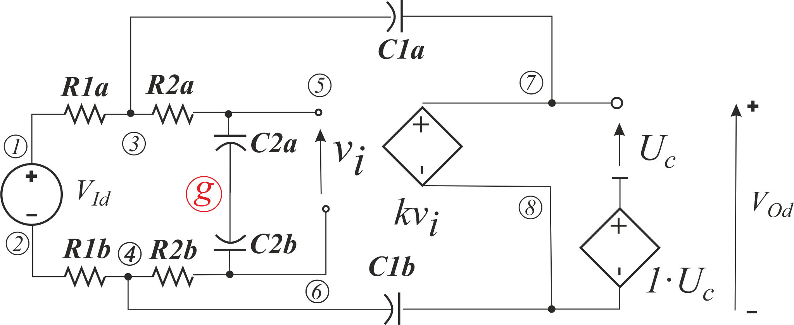
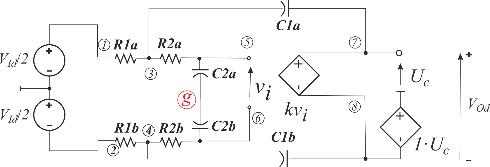
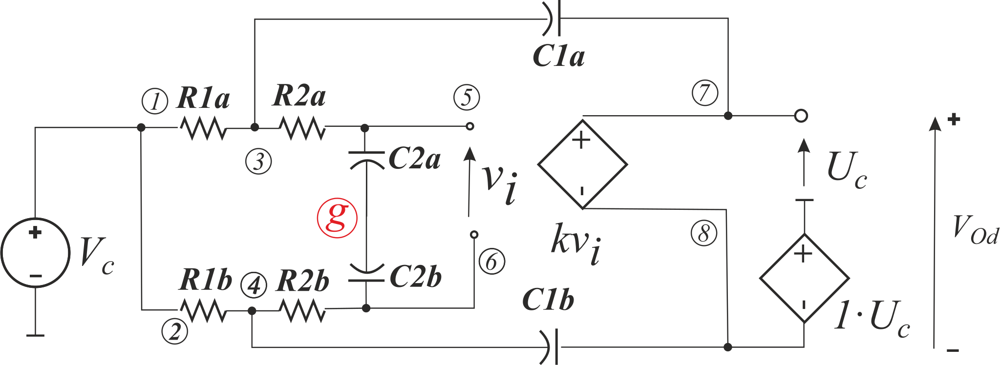

# Influence of asymmetry of components for transfer functions of the Sallen-Key filter made of FDCFOA.

To determine the analysis, we should use following models:

Results are complex and are presented in [raw text form](Models.txt) and [post-processed pdf](Models.pdf). Nevertheless, we can conclude that for the common gain preservation to be 0, the equality of time constants ***C1b⋅R1b=C1a⋅R1a*** is very important.
The following examples test less or more realistic models:

[10. Models by C. Sanchez-Lopez](../10.%20SimpModelSanchez-Lopez/)

[11. Models by C. Sanchez-Lopez improved](../11.%20SimpModelSanchez-LopezImproved/)

[13. Natural behavioral model made of controled sources](../13.%20SimpModelControlledSources/)

[14. Natural behavioral model made of controled sources – influence of assymetry](../14.%20SimpModelControlledSourcesAsym/)

[15. Natural behavioral model made of controled sources with kR improved](../15.%20SimpModelControlledSourcesImprovedkR/)

[16. Natural behavioral model made of controled sources with kR improved – inflence of assymetry](../16.%20SimpModelControlledSourcesImprovedkRAsym/)

[17. Black-box gneralisation of above models – some HPDD with HOSC trick](../17.%20SimplyGenSym/)

[18. Black-box gneralisation of above models – some HPDD with HOSC trick – influence of assymetry.](../18.%20SimplyGenAsym/)
