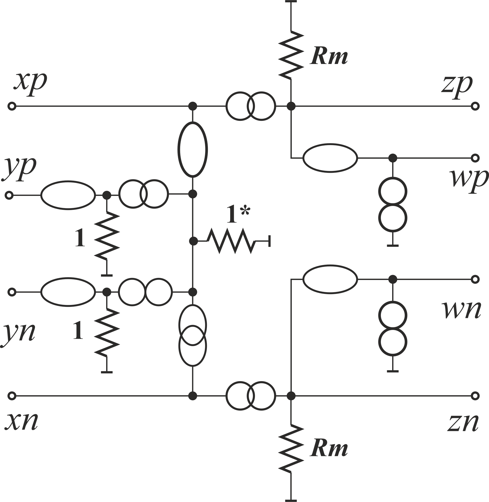

# Models by C. Sanchez-Lopez

Model from **C. Sanchez-Lopez, “Pathological Equivalents of Fully-Differential Active Devices for Symbolic Nodal Analysis,”** *IEEE Trans. Circuits Syst. I Regul. Pap.* **, vol. 60, no. 3, pp. 603–615, Mar. 2013**.

The model contains reference node. The author has connected both C2 to this node, which always yields to improper results (see [07](../07.%20SimplySKFloatingFilterUnPropGnd/)). The results can be studied from [result raw text](Models.txt) file or [post-processed pdf](Models.pdf).
The improved version of this circuit is available in [11](../11.%20SimpModelSanchez-LopezImproved/). C. Sanchez-Lopez has analysed asymetric ciruit, but for improper configuration. It was difficult to find wrong results.

