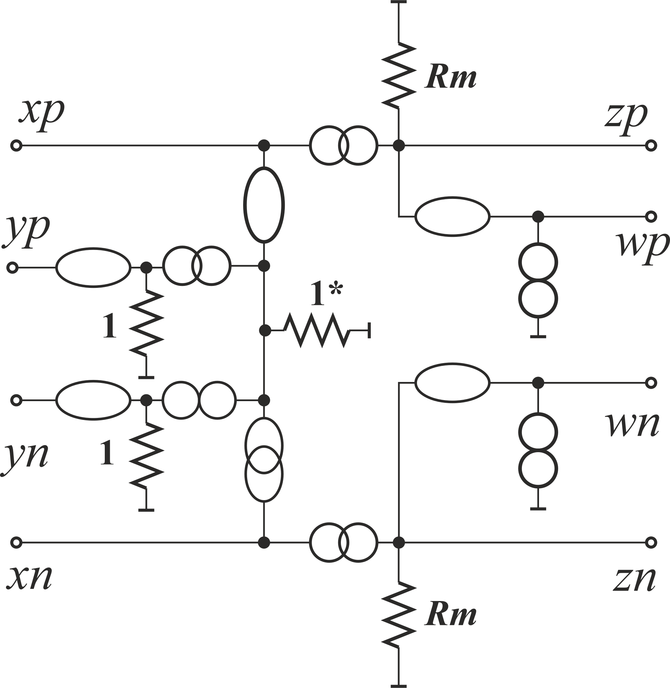
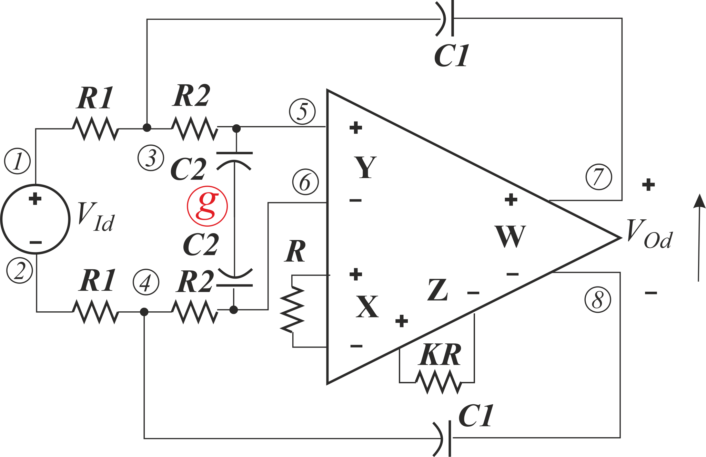
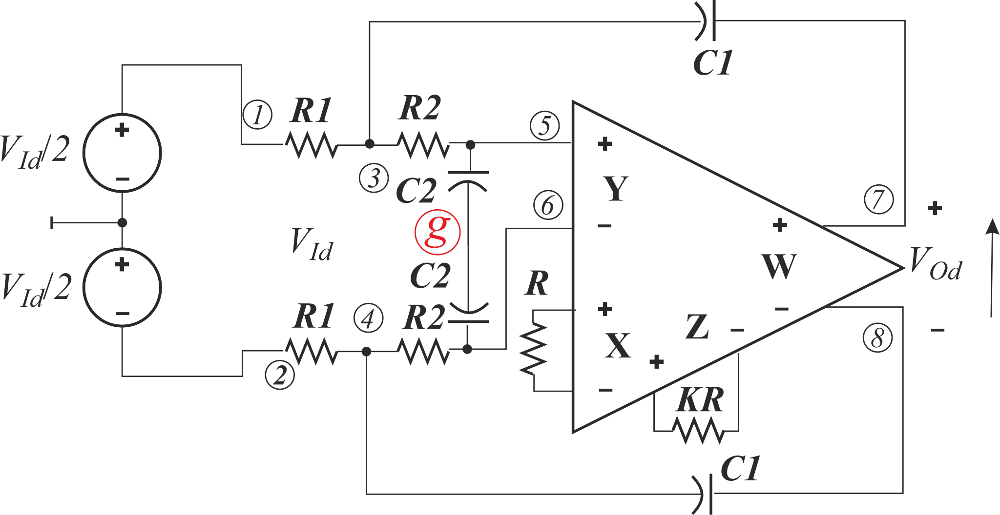
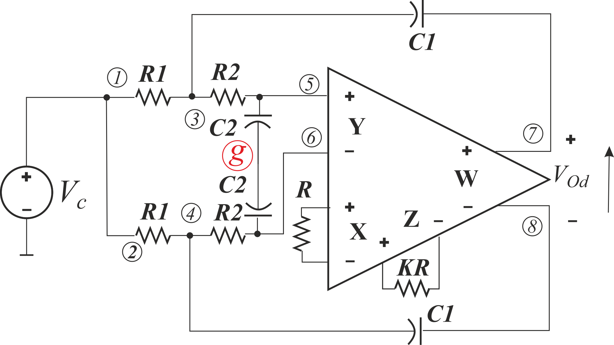

# Models by C. Sanchez-Lopez improved

Model from **C. Sanchez-Lopez, “Pathological Equivalents of Fully-Differential Active Devices for Symbolic Nodal Analysis,”** *IEEE Trans. Circuits Syst. I Regul. Pap.* **, vol. 60, no. 3, pp. 603–615, Mar. 2013**.

Improved version of [10](../10.%20SimpModelSanchez-Lopez/). Now, the results are reasonable (see [result raw text](Models.txt) or [post-processed pdf](Models.pdf)). However, some mistake in model CFM causes that gain is twice larger. The results are quite complicated to analyze. Simpler, but almost the same accurate results can be found if we assume that *Rm* tends to infty, because is is usally very largr. *Kuc* remains 0.