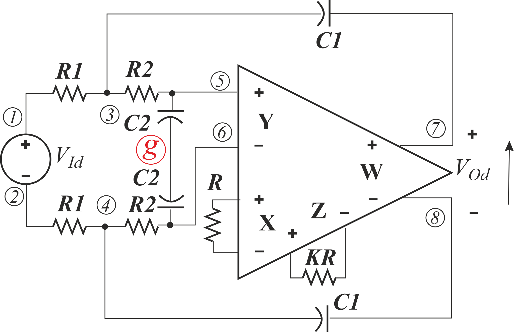
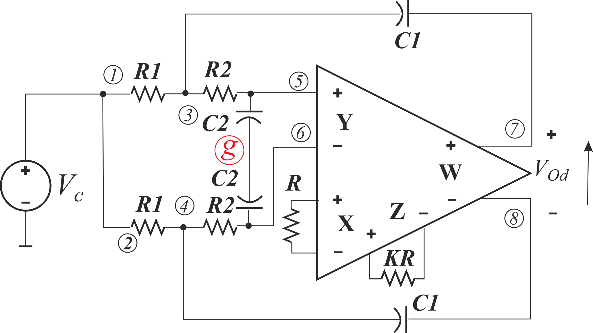

# Natural behavioral model made of controled sources

In literature there can be found two version of FDCFOA impementation. All of them have CFMB at the input. It is necesarry to immediate removig of a larg common signal at the output. However, the output can be different. In some application instead of fully differential buffer, we can find 2 separate buffers: one for positive and another for negative voltages around the device reference node (e.g. **M. Kumngern, F. Khateb, and T. Kulej, “0.5 V bulk-driven CMOS fully differential current feedback operational amplifier,”** *IET Circuits,Devices Syst.* **, vol. 13, no. 3, pp. 314–320, may 2019**). Thus, there are two different models tested:

*Model with CFMB at the output (Model 1)*

*Model without CFMB at the output (Model 2)*

We tested them in circuits:

There four set of results:
1. Idealized (no tracking errors) with Model 1: in [row text form](./Models_CFMB_OUT%20Ideal.txt) and [post-processed pdf](Models_CFMB_OUT%20Ideal.pdf).
2. With tracking error consideration and Model 1: in [row text form](Models_TE_CFMB_OUT.txt) and [post-processed pdf](Models_TE_CFMB_OUT.pdf).
3. Idealized (no tracking errors) with Model 2: in [row text form](Models_NO_CFMB%20Ideal.txt) and [post-processed pdf](Models_NO_CFMB%20Ideal.pdf).
4. With tracking error consideration and Model 2: in [row text form](Models_TE_NO_CFMB_OUT.txt) and [post-processed pdf](Models_TE_NO_CFMB_OUT.pdf).

Results show that tracking errors can be compensated by proper choice of resistors *R* and *kR*. The results can be simpler if we assume that *Rm* tends to infinity, which is reasonable.

Models are simplification of the actual structure that shows each possible circuit behavior, even if it is connected in uncommon way (the model from [10](../10.%20SimpModelSanchez-Lopez/) and [11](../11.%20SimpModelSanchez-LopezImproved/) is not so flexible). Connecting *R* and *kR* reduces model significantly. 

The same results, but for asymetric external circuit can be seen in [14](../14.%20SimpModelControlledSourcesAsym/).