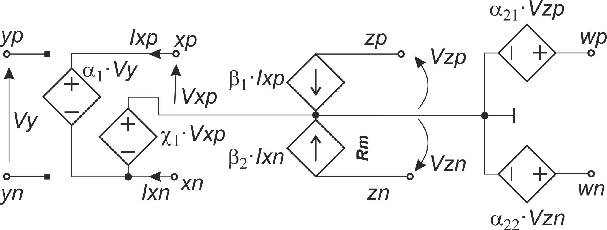

# Natural behavioral model made of controled sources – improved *kR* connection - asymetric external ciruit

In literature there can be found two version of FDCFOA impementation. All of them have CFMB at the input. It is necesarry to immediate removig of a larg common signal at the output. However, the output can be different. In some application instead of fully differential buffer, we can find 2 separate buffers: one for positive and another for negative voltages around the device reference node (e.g. **M. Kumngern, F. Khateb, and T. Kulej, “0.5 V bulk-driven CMOS fully differential current feedback operational amplifier,”** *IET Circuits,Devices Syst.* **, vol. 13, no. 3, pp. 314–320, may 2019**). Thus, there are two different models tested:

*Model with CFMB at the output (Model 1)*

*Model without CFMB at the output (Model 2)*

In the most papers, the authors assume the component *kR* to be connected between nodes *Z*. However, it can cause some problems. If FDCFOA is symterical, it works good. Then, the current that flows out the node *Zp* flows into node *Zn*. It causes that the current must flow through *kR*, and no current can leak to any of *Rm*, and the volttage in *Zp* and *Zn* is almost equal to the reference node a device (e.g. the midpoint of the power supply voltages). The spread of these both resistors can be ignored. However, if the current tracking errors are slightly different in both channels, it is not true. Resitors *Rm* are large. The small difference between curents can overshot the acceptable voltage (above or beneath the power supply). See [perturabtion example](../19.%20Perturbation/). Thus, we propose to connect *kR* as two *k1R* and *k2R*, between *Z* nodes and device refference node. Because *Rm* is large, can be immediately skipped as larger than *k1R* and *k2R*. That is why models are simplified and we teste them in a circuits:

There four set of results:
1. Idealized (no tracking errors) with Model 1: in [row text form](./Models_CFMB.txt) and [post-processed pdf](./Models_CFMB.pdf).
2. With tracking error consideration and Model 1: in [row text form](./ModelsTE_CFMB.txt) and [post-processed pdf](./ModelsTE_CFMB.pdf).
3. Idealized (no tracking errors) with Model 2: in [row text form](./Models_NO_CFMB_OUT.txt) and [post-processed pdf](./Models_NO_CFMB_OUT.pdf).
4. With tracking error consideration and Model 2: in [row text form](./ModelsTE_NO_CFMB.txt) and [post-processed pdf](./ModelsTE_NO_CFMB.pdf).

Results are simpler than in case of traditional configuration. *Rm* was skipped as much larger than our *kiR* components. However, the access to the device reference node is a problem. If we have symmetrical power supplier the reference node is a power supplier ground node. In case of single supply mode, we must to construct a classical phantom ground. Additionally, if our FDCFOA has some asymmetry with trucking errors *β1≠β2*, we can correct it. Because gain is ~(*k1R1+k2R2*), we can use one value for coarse and fine regulation.

Models are simplification of the actual structure that shows each possible circuit behavior, even if it is connected in uncommon way (the model from [10](../10.%20SimpModelSanchez-Lopez/) and [11](../11.%20SimpModelSanchez-LopezImproved/) is not so flexible). Connecting *R* and *kR* reduces model significantly. 

The lack of unnecessary *Rm* couse the analysis simpler than in [14](../14.%20SimpModelControlledSourcesAsym/). However, not so simply like in [18](../18.%20SimplyGenAsym/).