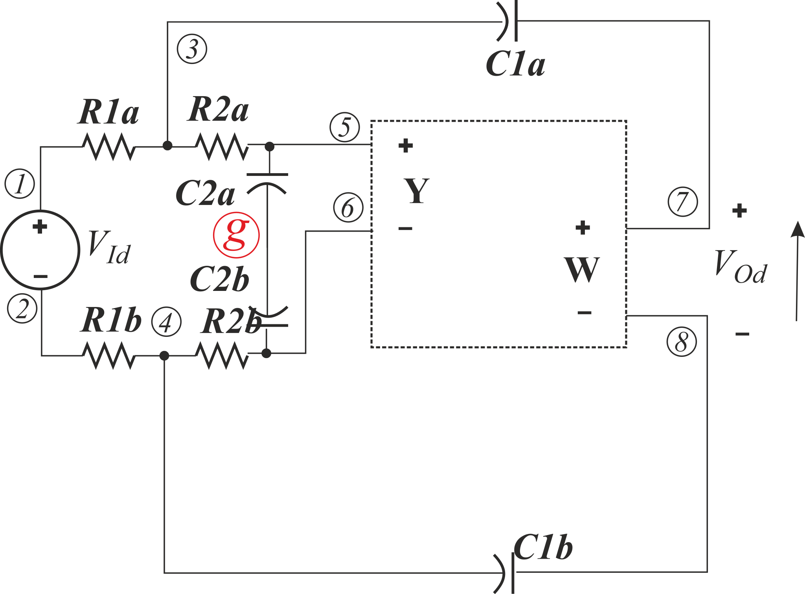
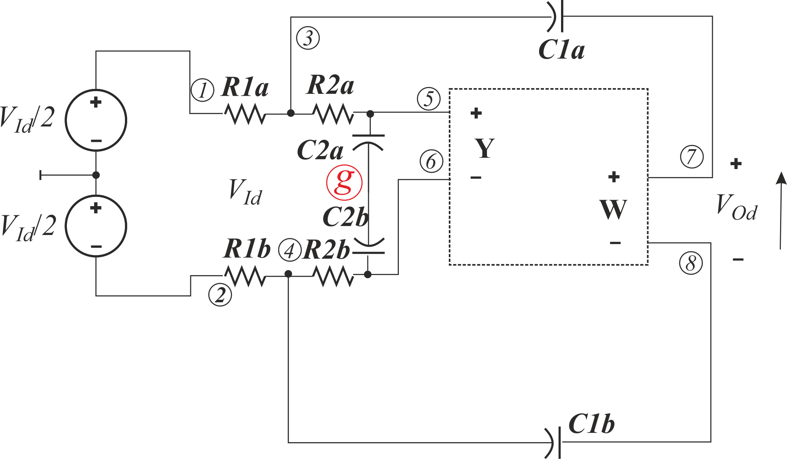
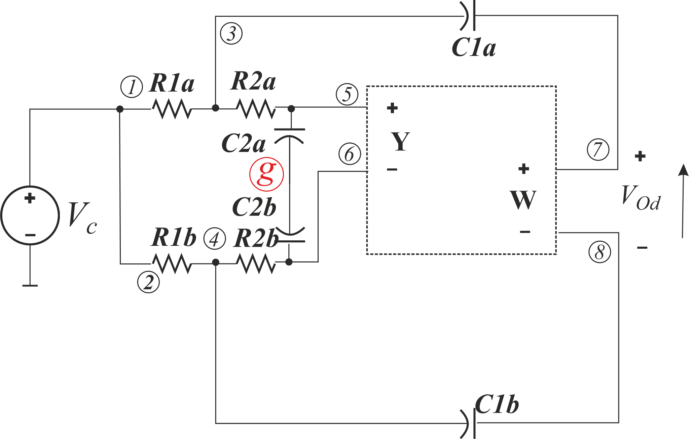

# General FDCFOA Sallen-Key Filter Analysis – An Asymmetrical Case

Model of FDCFA with resistor *R* in gate *X* and resistor *kR* in gate *Z* has a common form

<!-- $S0\cdot\varDelta_{(p+0)(k+l)}^{(p+0)(r+0)}+S1\cdot\varDelta_{(r+0)(k+l)}^{(p+0)(r+0)} +S2\cdot\varDelta_{(p+0)(r+0)}^{(p+0)(r+0)}$  -->
(k%2Bl)%7D%5E%7B(p%2B0)(r%2B0)%7D%2BS1%5Ccdot%5CvarDelta_%7B(r%2B0)(k%2Bl)%7D%5E%7B(p%2B0)(r%2B0)%7D%20%2BS2%5Ccdot%5CvarDelta_%7B(p%2B0)(r%2B0)%7D%5E%7B(p%2B0)(r%2B0)%7D)

They are:

1. 13.SimpModelControlledSources/Models_CFMB_OUT
    see [txt](../13.%20SimpModelControlledSources/Models_CFMB_OUT%20Ideal.txt) or [pdf](../13.%20SimpModelControlledSources/Models_NO_CFMB%20Ideal.txt)
    13.SimpModelControlledSources/Models_NO_CFMB_OUT see [txt](../13.%20SimpModelControlledSources/Models_NO_CFMB%20Ideal.txt) or [pdf](../13.%20SimpModelControlledSources/Models_NO_CFMB%20Ideal.pdf)
   14.SimpModelControlledSourcesAsym/Models_CFMB_OUT see [txt](../14.%20SimpModelControlledSourcesAsym/Models_CFMB_OUT.txt) or [pdf](../14.%20SimpModelControlledSourcesAsym/Models_NO_CFMB_OUT.pdf)
   14.SimpModelControlledSourcesAsym/Models_NO_CFMB_OUT see [txt](../14.%20SimpModelControlledSourcesAsym/ModelsTE_NO_CFMB.txt) or [pdf](../14.%20SimpModelControlledSourcesAsym/ModelsTE_NO_CFMB.pdf)

    
    <!-- $S0=S1=k$ -->
    )
    <!-- $S2=\left({{k\cdot R}\over{2\cdot R_m}} + 2\right)$ -->

2.	13.SimpModelControlledSources/Models_TE_CFMB_OUT see [txt](../13.%20SimpModelControlledSources/Models_TE_CFMB_OUT.txt)  or [pdf](../13.%20SimpModelControlledSources/Models_TE_NO_CFMB_OUT.pdf).
    14.SimpModelControlledSourcesAsym/Models_TE_CFMB_OUT [see](../14.%20SimpModelControlledSourcesAsym/ModelsTE_CFMB.txt) txt or [pdf](../14.%20SimpModelControlledSourcesAsym/ModelsTE_CFMB.pdf)

    %5Ccdot%5Calpha_2%5Ccdot%20k%5Ccdot%5Cchi_2)
    <!-- $S0=\alpha_1\cdot\left(\beta_2+\beta_1\right)\cdot\alpha_2\cdot k\cdot\chi_2$ -->
    %5Ccdot%5Calpha_2%5Ccdot%20k)
    <!-- $S1=\alpha_1\cdot\left(\beta_2+\beta_1\right)\cdot\alpha_2\cdot k$ -->
    %5Ccdot%5Cleft(%7B%7BR%5Ccdot%20k%7D%5Cover%20%7BR_m%7D%7D%20%2B2%5Cright))
    <!-- $S2=\left(1+\chi_2\right)\cdot\left({{R\cdot k}\over {R_m}} +2\right)$ -->

3. 13_SimpModelControlledSources/Models_TE_NO_CFMB_OUT see [txt](../13.13.%20SimpModelControlledSources/Models_TE_NO_CFMB_OUT.txt) or [pdf](../13.%20SimpModelControlledSources/Models_TE_NO_CFMB_OUT.pdf)
    14_SimpModelControlledSourcesAsym/Models_TE_NO_CFMB_OUT see [txt](14.../14.%20SimpModelControlledSourcesAsym/ModelsTE_NO_CFMB.txt) or [pdf](14.../14.%20SimpModelControlledSourcesAsym/Models_TE_NO_CFMB.pdf)

    %5Ccdot%20%7B%7BR_m%7D%5Cover%20%7BR%7D%7D%5Cright))
    <!-- $S0=\alpha_1\cdot\alpha_{22}\cdot(\beta_2\cdot k-\left(\beta_1-\beta_2)\cdot {{R_m}\over {R}}\right)$ -->
    %5Ccdot%20%7B%7BR_m%7D%5Cover%7BR%7D%7D%20%20%5Cright))
    <!-- $S1=\alpha_1\cdot\alpha_{21}\cdot\left(\beta_1\cdot k+ (\beta_1-\beta_2)\cdot {{R_m}\over{R}}  \right)$ -->
    )
    <!-- $S2=\left({{k\cdot R}\over{R_m}} +2\right)$ -->

4. 15.SimpModelControlledSourcesImprovedkR/Models_CFMB_OUT see [txt](../15.%20SimpModelControlledSourcesImprovedkR/Models_CFMB.txt) or [pdf](../15.%20SimpModelControlledSourcesImprovedkR/Models_NO_CFMB_OUT.pdf)
    16.SimpModelControlledSourcesImprovedkRAsym/Models_CFMB_OUT see [txt](../16.%20SimpModelControlledSourcesImprovedkRAsym/Models_CFMB_OUT.txt) or [pdf](../16.%20SimpModelControlledSourcesImprovedkRAsym/Models_NO_CFMB_OUT.pdf)
 
    
    <!-- $S0=S1=k1+k2$ -->
    
    <!-- $S2=2$ -->
	
5. 15.SimpModelControlledSourcesImprovedkR/Models_NO_CFMB_OUT see [txt](../15.%20SimpModelControlledSourcesImprovedkR/Models_NO_CFMB.docx) or [pdf](../15.%20SimpModelControlledSourcesImprovedkR/Models_NO_CFMB.pdf)
    16.SimpModelControlledSourcesImprovedkRAsym/Models_NO_CFMB_OUT see [txt](../16.%20SimpModelControlledSourcesImprovedkRAsym/Models_NO_CFMB.txt) or [pdf](../16.%20SimpModelControlledSourcesImprovedkRAsym/Models_NO_CFMB.pdf)

    
    <!-- $S0=k2$ -->
    
    <!-- $S1=k1$ -->
    
    
    <!-- $S2=1$ -->

6. 15.SimpModelControlledSourcesImprovedkR/Models_TE_CFMB_OUT see [txt](../15.%20SimpModelControlledSourcesImprovedkR/ModelsTE_CFMB.txt) or [pdf](../15.%20SimpModelControlledSourcesImprovedkR/ModelsTE_CFMB.pdf)
    16.SimpModelControlledSourcesImprovedkRAsym/Models_TE_CFMB_OUT see [txt](../16.%20SimpModelControlledSourcesImprovedkRAsym/ModelsTE_NO_CFMB.txt) or [pdf](../16.%20SimpModelControlledSourcesImprovedkRAsym/ModelsTE_NO_CFMB.pdf)

    %5Ccdot%5Cchi_2)
    <!-- $S0=\alpha_1\cdot\alpha_2\cdot(\beta_2\cdot k2+\beta_1\cdot k1)\cdot\chi_2$
     -->
    ) 
    <!-- $S1=\alpha_1\cdot\alpha_2\cdot(\beta_2\cdot k2+\beta_1\cdot k1)$ -->
    )
    <!-- $S2=(1+\chi_2)$ -->
	
 7. 15.SimpModelControlledSourcesImprovedkR/Models_TE_NO_CFMB_OUT see [txt](../15.%20SimpModelControlledSourcesImprovedkR/ModelsTE_NO_CFMB.txt) or [pdf](../15.%20SimpModelControlledSourcesImprovedkR/ModelsTE_NO_CFMB.pdf)
    16.SimpModelControlledSourcesImprovedkRAsym/Models_TE_NO_CFMB_OUT see [txt](../16.%20SimpModelControlledSourcesImprovedkRAsym/ModelsTE_NO_CFMB.txt) or [pdf](../16.%20SimpModelControlledSourcesImprovedkRAsym/ModelsTE_NO_CFMB.pdf)

    
    <!-- $S0=\alpha_1\cdot\beta_2\cdot\alpha_{22}\cdot k2$ -->
    
    <!-- $S1=\alpha_1\cdot\beta_1\cdot\alpha_{21}\cdot k1$ -->
    
    <!-- $S2=1$ -->

Instead of determining the final transfer function, which can be difficult for the further post-processing, we can disperse each HOSC to 3 adding additional deletions.

In such a case we should determine:

%7D%5E%7B(2%2B1)%7D%5Crightarrow%20S0%5Ccdot%5CvarDelta_%7B(2%2B1)(7%2B0)(5%2B6)%7D%5E%7B(2%2B1)(7%2B0)(8%2B0)%7D%2BS1%5Ccdot%5CvarDelta_%7B(2%2B1)(8%2B0)(5%2B6)%7D%5E%7B(2%2B1)(7%2B0)(8%2B0)%7D%2BS2%5Ccdot%5CvarDelta_%7B(2%2B1)(7%2B0)(8%2B0)%7D%5E%7B(2%2B1)(7%2B0)(8%2B0)%7D)
<!-- $\varDelta_{(2+1)}^{(2+1)}\rightarrow S0\cdot\varDelta_{(2+1)(7+0)(5+6)}^{(2+1)(7+0)(8+0)}+S1\cdot\varDelta_{(2+1)(8+0)(5+6)}^{(2+1)(7+0)(8+0)}+S2\cdot\varDelta_{(2+1)(7+0)(8+0)}^{(2+1)(7+0)(8+0)}$ -->

%7D%5E%7B(2%2B1)%7D%5Crightarrow%20S0%5Ccdot%5CvarDelta_%7B(8%2B7)(7%2B0)(5%2B6)%7D%5E%7B(2%2B1)(7%2B0)(8%2B0)%7D%20%2BS1%5Ccdot%5CvarDelta_%7B(8%2B7)(8%2B0)(5%2B6)%7D%5E%7B(2%2B1)(7%2B0)(8%2B0)%7D%20%2BS2%5Ccdot%5CvarDelta_%7B(8%2B7)(7%2B0)(8%2B0)%7D%5E%7B(2%2B1)(7%2B0)(8%2B0)%7D)
<!-- $\varDelta_{(8+7)}^{(2+1)}\rightarrow S0\cdot\varDelta_{(8+7)(7+0)(5+6)}^{(2+1)(7+0)(8+0)} +S1\cdot\varDelta_{(8+7)(8+0)(5+6)}^{(2+1)(7+0)(8+0)} +S2\cdot\varDelta_{(8+7)(7+0)(8+0)}^{(2+1)(7+0)(8+0)}$ -->

(2%2B1)%7D%5E%7B(2%2B0)(2%2B1)%7D%5Crightarrow%20S0%5Ccdot%5CvarDelta_%7B(2%2B0)(2%2B1)(7%2B0)(5%2B6)%7D%5E%7B(2%2B0)(2%2B1)(7%2B0)(8%2B0)%7D%20%2B%20S1%5Ccdot%5CvarDelta_%7B(2%2B0)(2%2B1)(8%2B0)(5%2B6)%7D%5E%7B(2%2B0)(2%2B1)(7%2B0)(8%2B0)%7D%2BS2%5Ccdot%5CvarDelta_%7B(2%2B0)(2%2B1)(7%2B0)(8%2B0)%7D%5E%7B(2%2B0)(2%2B1)(7%2B0)(8%2B0)%7D)
<!-- $\varDelta_{(2+0)(2+1)}^{(2+0)(2+1)}\rightarrow S0\cdot\varDelta_{(2+0)(2+1)(7+0)(5+6)}^{(2+0)(2+1)(7+0)(8+0)} + S1\cdot\varDelta_{(2+0)(2+1)(8+0)(5+6)}^{(2+0)(2+1)(7+0)(8+0)}+S2\cdot\varDelta_{(2+0)(2+1)(7+0)(8+0)}^{(2+0)(2+1)(7+0)(8+0)}$ -->

(7%2B8)%7D%5E%7B(2%2B1)(2%2B0)%7D%5Crightarrow%20S0%5Ccdot%5CvarDelta_%7B(2%2B1)(7%2B8)(7%2B0)(5%2B6)%7D%5E%7B(2%2B1)(2%2B0)(7%2B0)(8%2B0)%7D%2BS1%5Ccdot%5CvarDelta_%7B(2%2B1)(7%2B8)(8%2B0)(5%2B6)%7D%5E%7B(2%2B1)(2%2B0)(7%2B0)(8%2B0)%7D%2BS2%5Ccdot%5CvarDelta_%7B(2%2B1)(7%2B8)(7%2B0)(8%2B0)%7D%5E%7B(2%2B1)(2%2B0)(7%2B0)(8%2B0)%7D)
<!-- $\varDelta_{(2+1)(7+8)}^{(2+1)(2+0)}\rightarrow S0\cdot\varDelta_{(2+1)(7+8)(7+0)(5+6)}^{(2+1)(2+0)(7+0)(8+0)}+S1\cdot\varDelta_{(2+1)(7+8)(8+0)(5+6)}^{(2+1)(2+0)(7+0)(8+0)}+S2\cdot\varDelta_{(2+1)(7+8)(7+0)(8+0)}^{(2+1)(2+0)(7+0)(8+0)}$  -->

(2-1)%7D%5E%7B(1%2B0)(2%2B0)%7D%5Crightarrow%20S0%5Ccdot%5CvarDelta_%7B(7%2B8)(2-1)(7%2B0)(5%2B6)%7D%5E%7B(1%2B0)(2%2B0)(7%2B0)(8%2B0)%7D%2BS1%5Ccdot%5CvarDelta_%7B(7%2B8)(2-1)(8%2B0)(5%2B6)%7D%5E%7B(1%2B0)(2%2B0)(7%2B0)(8%2B0)%7D%2BS2%5Ccdot%5CvarDelta_%7B(7%2B8)(2-1)(7%2B0)(8%2B0)%7D%5E%7B(1%2B0)(2%2B0)(7%2B0)(8%2B0)%7D)
<!-- $\varDelta_{(7+8)(2-1)}^{(1+0)(2+0)}\rightarrow S0\cdot\varDelta_{(7+8)(2-1)(7+0)(5+6)}^{(1+0)(2+0)(7+0)(8+0)}+S1\cdot\varDelta_{(7+8)(2-1)(8+0)(5+6)}^{(1+0)(2+0)(7+0)(8+0)}+S2\cdot\varDelta_{(7+8)(2-1)(7+0)(8+0)}^{(1+0)(2+0)(7+0)(8+0)}$  -->

However, circuits to analyze simplify to:

As result of simulation we have

<!-- $K_{u}={{N_{K_{U}}}\over{D_{K_{U}}}}$ -->
where

%5Ccdot%20(C1b%2BC1a)%5Ccdot%20(C2a%2BC2b))
<!-- $N_{K_{U}}=(S0+S1)\cdot (C1b+C1a)\cdot (C2a+C2b)$ -->

and

 <!-- $D_{K_{U}}$ --> is too large to present it here, see in [pdf](Models.pdf).

<!-- $K_{u_{com}}={{N_{K_{u_{com}}}}\over{D_{K_{u_{com}}}}}$ -->

where

%5Ccdot%20s%5E2%5Ccdot%20(R1a%5Ccdot%20C1a-R1b%5Ccdot%20C1b)%5Ccdot%20(C2a%2BC2b))
<!-- $N_{K_{uc}}=-(S0+S1)\cdot s^2\cdot (R1a\cdot C1a-R1b\cdot C1b)\cdot (C2a+C2b)$ -->

and

 <!-- $D_{K_{U_{com}}}$ --> is too large to present it here, see in [pdf](Models.pdf).

It becomes obvious that the only thing we have to do obtain the common gain to be equal 0 is to satisfy: 𝑅1𝑏⋅𝐶1𝑏=𝑅1𝑎⋅𝐶1𝑎, for any version of FDCFO and it does not depend on any tracking errors in the active device. The long denominator presented below is not necessary to obtain for concluding it.

The surrounding circuit around the active device causes that S0≡S1. Thus:

1. 13.SimpModelControlledSources/Models_CFMB_OUT
    see [txt](../13.%20SimpModelControlledSources/Models_CFMB_OUT%20Ideal.txt) or [pdf](../13.%20SimpModelControlledSources/Models_NO_CFMB%20Ideal.txt)
    13.SimpModelControlledSources/Models_NO_CFMB_OUT see [txt](../13.%20SimpModelControlledSources/Models_NO_CFMB%20Ideal.txt) or [pdf](../13.%20SimpModelControlledSources/Models_NO_CFMB%20Ideal.pdf)
   14.SimpModelControlledSourcesAsym/Models_CFMB_OUT see [txt](../14.%20SimpModelControlledSourcesAsym/Models_CFMB_OUT.txt) or [pdf](../14.%20SimpModelControlledSourcesAsym/Models_NO_CFMB_OUT.pdf)
   14.SimpModelControlledSourcesAsym/Models_NO_CFMB_OUT see [txt](../14.%20SimpModelControlledSourcesAsym/ModelsTE_NO_CFMB.txt) or [pdf](../14.%20SimpModelControlledSourcesAsym/ModelsTE_NO_CFMB.pdf)

    
    <!-- $S0+S1=2k$ -->

    %5Capprox%202)
    <!-- $S2=\left({{k\cdot R}\over{2\cdot R_m}} + 2\right)\approx 2$ -->

2.	13.SimpModelControlledSources/Models_TE_CFMB_OUT see [txt](../13.%20SimpModelControlledSources/Models_TE_CFMB_OUT.txt)  or [pdf](../13.%20SimpModelControlledSources/Models_TE_NO_CFMB_OUT.pdf).
    14.SimpModelControlledSourcesAsym/Models_TE_CFMB_OUT [see](../14.%20SimpModelControlledSourcesAsym/ModelsTE_CFMB.txt) txt or [pdf](../14.%20SimpModelControlledSourcesAsym/ModelsTE_CFMB.pdf)

    %5Ccdot%5Calpha_1%5Ccdot%5Cleft(%5Cbeta_2%2B%5Cbeta_1%5Cright)%5Ccdot%5Calpha_2%5Ccdot%20k%20%5Crightarrow%20%5Calpha_1%5Ccdot%5Cleft(%5Cbeta_2%2B%5Cbeta_1%5Cright)%5Ccdot%5Calpha_2%5Ccdot%20k)
    <!-- $S0+S1=(1+\chi_2)\cdot\alpha_1\cdot\left(\beta_2+\beta_1\right)\cdot\alpha_2\cdot k \rightarrow \alpha_1\cdot\left(\beta_2+\beta_1\right)\cdot\alpha_2\cdot k$ -->

    %5Ccdot%5Cleft(%7B%7BR%5Ccdot%20k%7D%5Cover%20%7BR_m%7D%7D%20%2B2%5Cright)%5Crightarrow%20%5Cleft(%7B%7BR%5Ccdot%20k%7D%5Cover%20%7BR_m%7D%7D%20%2B2%5Cright)%5Capprox%202)
    <!-- $S2=\left(1+\chi_2\right)\cdot\left({{R\cdot k}\over {R_m}} +2\right)\rightarrow \left({{R\cdot k}\over {R_m}} +2\right)\approx 2$ -->

3. 13_SimpModelControlledSources/Models_TE_NO_CFMB_OUT see [txt](../13.13.%20SimpModelControlledSources/Models_TE_NO_CFMB_OUT.txt) or [pdf](../13.%20SimpModelControlledSources/Models_TE_NO_CFMB_OUT.pdf)
    14_SimpModelControlledSourcesAsym/Models_TE_NO_CFMB_OUT see [txt](14.../14.%20SimpModelControlledSourcesAsym/ModelsTE_NO_CFMB.txt) or [pdf](14.../14.%20SimpModelControlledSourcesAsym/Models_TE_NO_CFMB.pdf)

    %5Ccdot%20k%20%2B%5Cleft(%5Calpha_%7B21%7D-%5Calpha_%7B22%7D%5Cright)%5Ccdot%20%5Cleft(%5Cbeta_1-%5Cbeta_2%5Cright)%5Ccdot%20%7B%7BR_m%7D%5Cover%20R%7D%5Cright))
    <!-- $S0+S1=\alpha_1\cdot \left(\left(\alpha_{22}\cdot \beta_2+\alpha_{21}\cdot \beta_1 \right)\cdot k +\left(\alpha_{21}-\alpha_{22}\right)\cdot \left(\beta_1-\beta_2\right)\cdot {{R_m}\over R}\right)$ -->

    %20%5Capprox%202)
    <!-- $S2=\left({{k\cdot R}\over{R_m}} +2\right) \approx 2$ -->

4. 15.SimpModelControlledSourcesImprovedkR/Models_CFMB_OUT see [txt](../15.%20SimpModelControlledSourcesImprovedkR/Models_CFMB.txt) or [pdf](../15.%20SimpModelControlledSourcesImprovedkR/Models_NO_CFMB_OUT.pdf)
    16.SimpModelControlledSourcesImprovedkRAsym/Models_CFMB_OUT see [txt](../16.%20SimpModelControlledSourcesImprovedkRAsym/Models_CFMB_OUT.txt) or [pdf](../16.%20SimpModelControlledSourcesImprovedkRAsym/Models_NO_CFMB_OUT.pdf)
 
    )
    <!-- $S0+S1=2\cdot (k1+k2)$ -->

    
    <!-- $S2=2$ -->
	
5. 15.SimpModelControlledSourcesImprovedkR/Models_NO_CFMB_OUT see [txt](../15.%20SimpModelControlledSourcesImprovedkR/Models_NO_CFMB.docx) or [pdf](../15.%20SimpModelControlledSourcesImprovedkR/Models_NO_CFMB.pdf)
    16.SimpModelControlledSourcesImprovedkRAsym/Models_NO_CFMB_OUT see [txt](../16.%20SimpModelControlledSourcesImprovedkRAsym/Models_NO_CFMB.txt) or [pdf](../16.%20SimpModelControlledSourcesImprovedkRAsym/Models_NO_CFMB.pdf)

    
    <!-- $S0+S1=k2+k1$ -->
    
    
    <!-- $S2=1$ -->

6. 15.SimpModelControlledSourcesImprovedkR/Models_TE_CFMB_OUT see [txt](../15.%20SimpModelControlledSourcesImprovedkR/ModelsTE_CFMB.txt) or [pdf](../15.%20SimpModelControlledSourcesImprovedkR/ModelsTE_CFMB.pdf)
    16.SimpModelControlledSourcesImprovedkRAsym/Models_TE_CFMB_OUT see [txt](../16.%20SimpModelControlledSourcesImprovedkRAsym/ModelsTE_NO_CFMB.txt) or [pdf](../16.%20SimpModelControlledSourcesImprovedkRAsym/ModelsTE_NO_CFMB.pdf)

    %5Ccdot%5Cleft(1%2B%5Cchi_2%5Cright)%20%5Crightarrow%20%5Calpha_1%5Ccdot%5Calpha_2%5Ccdot%5Cleft(%5Cbeta_2%5Ccdot%20k2%2B%5Cbeta_1%5Ccdot%20k1%5Cright))
    <!-- $S0+S1=\alpha_1\cdot\alpha_2\cdot\left(\beta_2\cdot k2+\beta_1\cdot k1\right)\cdot\left(1+\chi_2\right) \rightarrow \alpha_1\cdot\alpha_2\cdot\left(\beta_2\cdot k2+\beta_1\cdot k1\right)$ -->

    %20%5Crightarrow%201)
    <!-- $S2=(1+\chi_2) \rightarrow 1$ -->
	
 7. 15.SimpModelControlledSourcesImprovedkR/Models_TE_NO_CFMB_OUT see [txt](../15.%20SimpModelControlledSourcesImprovedkR/ModelsTE_NO_CFMB.txt) or [pdf](../15.%20SimpModelControlledSourcesImprovedkR/ModelsTE_NO_CFMB.pdf)
    16.SimpModelControlledSourcesImprovedkRAsym/Models_TE_NO_CFMB_OUT see [txt](../16.%20SimpModelControlledSourcesImprovedkRAsym/ModelsTE_NO_CFMB.txt) or [pdf](../16.%20SimpModelControlledSourcesImprovedkRAsym/ModelsTE_NO_CFMB.pdf)

    )
    <!-- $S0+S1=\alpha_1\cdot\beta_2\cdot\left(\alpha_{22}\cdot k2 + \alpha_{21}\cdot k1\right)$ -->

    
    <!-- $S2=1$ -->
