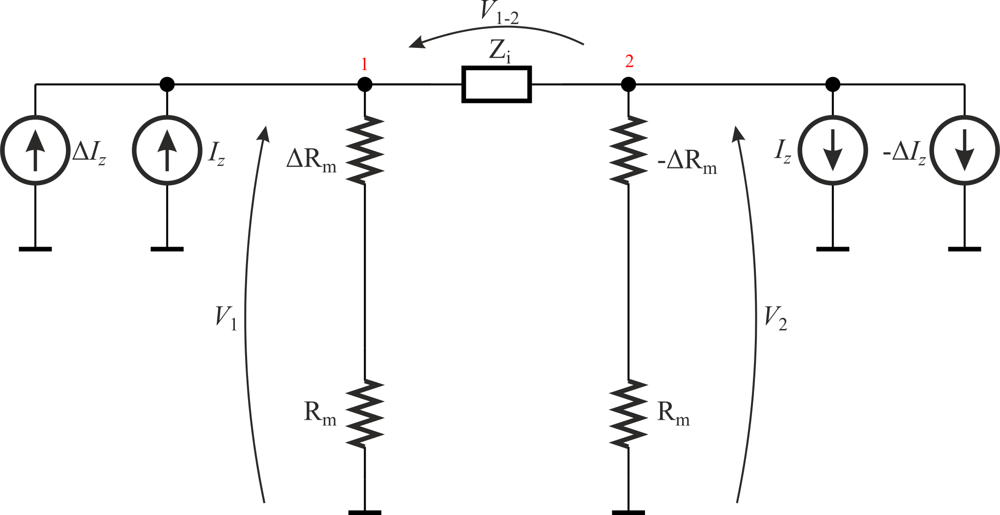

# Symbolic perturbation analysis for quality assessment of classical *kR* configuration in FDCFOA

The example is simply, but show how to use a set of exactly the same parameters and define sofisticated transfer functions.

A differential voltage.

%7D%3D%7B%7B%5CvarDelta_%7B(1%2B2)%7D%5E%7B(1%2B0)%7D%5Ccdot%20%5Cleft(I_Z%2B%7B%7B%5CvarDelta%20I_z%7D%5Cover%202%7D%5Cright)%2B%5CvarDelta_%7B(1%2B2)%7D%5E%7B(0%2B2)%7D%5Ccdot%20%5Cleft(I_Z-%7B%7B%5CvarDelta%20I_Z%7D%5Cover%202%7D%5Cright)%7D%5Cover%20%5CvarDelta%7D)
<!-- $V_{(1-2)}={{\varDelta_{(1+2)}^{(1+0)}\cdot \left(I_Z+{{\varDelta I_z}\over 2}\right)+\varDelta_{(1+2)}^{(0+2)}\cdot \left(I_Z-{{\varDelta I_Z}\over 2}\right)}\over \varDelta}$ -->

After simplification we obtain:

%7D%3D%7B%7B%5CvarDelta_%7B(1%2B2)%7D%5E%7B(1%2B2)%7D%7D%5Cover%5CvarDelta%7D%20%5Ccdot%20I_Z%2B%7B%7B%5CvarDelta_%7B(1%2B2)%7D%5E%7B(1-2)%7D%7D%5Cover%7B2%5Ccdot%20%5CvarDelta%20%7D%7D%5Ccdot%20%5CvarDelta%20I_Z%20%7D)
<!-- $\boxed{V_{(1-2)}={{\varDelta_{(1+2)}^{(1+2)}}\over\varDelta} \cdot I_Z+{{\varDelta_{(1+2)}^{(1-2)}}\over{2\cdot \varDelta }}\cdot \varDelta I_Z }$ -->

A common voltage.

%7D%5E%7B(1%2B0)%7D%5Ccdot%20%5Cleft(I_Z%2B%7B%7B%5CvarDelta%20I_z%7D%5Cover2%7D%5Cright)%2B%5CvarDelta_%7B(1%2B0)%7D%5E%7B(0%2B2)%7D%5Ccdot%20%5Cleft(I_Z-%7B%7B%5CvarDelta%20I_Z%7D%5Cover2%7D%5Cright)%7D%5Cover%20%5CvarDelta%7D)
<!-- $V_1={{\varDelta_{(1+0)}^{(1+0)}\cdot \left(I_Z+{{\varDelta I_z}\over2}\right)+\varDelta_{(1+0)}^{(0+2)}\cdot \left(I_Z-{{\varDelta I_Z}\over2}\right)}\over \varDelta}$ -->

%7D%5E%7B(1%2B0)%7D%5Ccdot%20%5Cleft(I_Z%2B%7B%7B%5CvarDelta%20I_z%7D%5Cover%202%7D%5Cright)%2B%5CvarDelta_%7B(2%2B0)%7D%5E%7B(0%2B2)%7D%5Ccdot%20%5Cleft(I_Z-%7B%7B%5CvarDelta%20I_Z%7D%5Cover2%7D%5Cright)%7D%5Cover%5CvarDelta%7D)
<!-- $V_2={{\varDelta _{(2+0)}^{(1+0)}\cdot \left(I_Z+{{\varDelta I_z}\over 2}\right)+\varDelta_{(2+0)}^{(0+2)}\cdot \left(I_Z-{{\varDelta I_Z}\over2}\right)}\over\varDelta}$ -->

<!-- $V_{com}={{V_1+V_2}\over2}$ -->

After reordering and simplifying, we obtain:

%7D%5E%7B(1%2B2)%7D%7D%5Cover%7B2%5Ccdot%20%5CvarDelta%20%7D%7D%5Ccdot%20I_Z%2B%7B%7B%5CvarDelta_%7B(1-2)%7D%5E%7B(1-2)%7D%7D%5Cover%7B4%5Ccdot%20%5CvarDelta%7D%7D%5Ccdot%20%5CvarDelta%20I_Z%7D)
<!-- $\boxed{V_{com}={{\varDelta_{(1-2)}^{(1+2)}}\over{2\cdot \varDelta }}\cdot I_Z+{{\varDelta_{(1-2)}^{(1-2)}}\over{4\cdot \varDelta}}\cdot \varDelta I_Z}$ -->

There is no negative resistance in PDD with HOSC. However, *-ΔRm* can be modeled as a transimpedance. A few different components with the same literal can be treated as one subcircuit only if each component is the same type. Thus, *ΔRm* should be modeled as the transimpedance, as well.

Voltages after simplifications:

%7D%3D%7B%7B2%5Ccdot%20Z_i%5Ccdot%20R_m%7D%5Cover%7B%5CvarDelta%20Z_i%2B2%5Ccdot%20R_m%7D%7D%5Ccdot%20I_Z%2B%7B%7BZ_i%5Ccdot%20%5CvarDelta%20R_m%7D%5Cover%7BZ_i%2B2%5Ccdot%20R_m%7D%7D%5Ccdot%20%5CvarDelta%20I_Z)
<!-- $V_{(1-2)}={{2\cdot Z_i\cdot R_m}\over{\varDelta Z_i+2\cdot R_m}}\cdot I_Z+{{Z_i\cdot \varDelta R_m}\over{Z_i+2\cdot R_m}}\cdot \varDelta I_Z$ -->

<!-- $V_{com}={{Z_i\cdot \varDelta R_m}\over {Z_i+2\cdot R_m}}\cdot I_Z+\boxed{{{R_m}\over 2}\cdot \varDelta I_Z}-{{\varDelta R_m^2}\over {Z_i+2\cdot R_m}}\cdot \varDelta I_Z$ -->

To have small influence of asymmetry of current for the voltage drop *V(1-2)*, we should have rather large *Rm* (and it really is). However, large *Rm* can be a reason of large *Vcom*, even for small asymmetry between Z currents. It can easily exceed some power supply voltage and latch the circuit.
