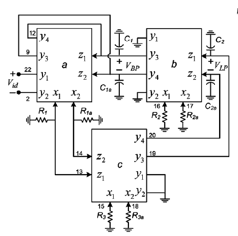

# FDCCII-Based Filter

2-nd example from:
**C. Sanchez-Lopez, “Pathological Equivalents of Fully-Differential Active Devices for Symbolic Nodal Analysis,”** *IEEE Trans. Circuits Syst. I Regul. Pap.* **, vol. 60, no. 3, pp. 603–615, Mar. 2013**.

The diagram in a copy of that from paper mentioned above. In *PDD with HOSC* approach there are only 8 nodes + reference one. However, nodes needn't to be consecutive. 
